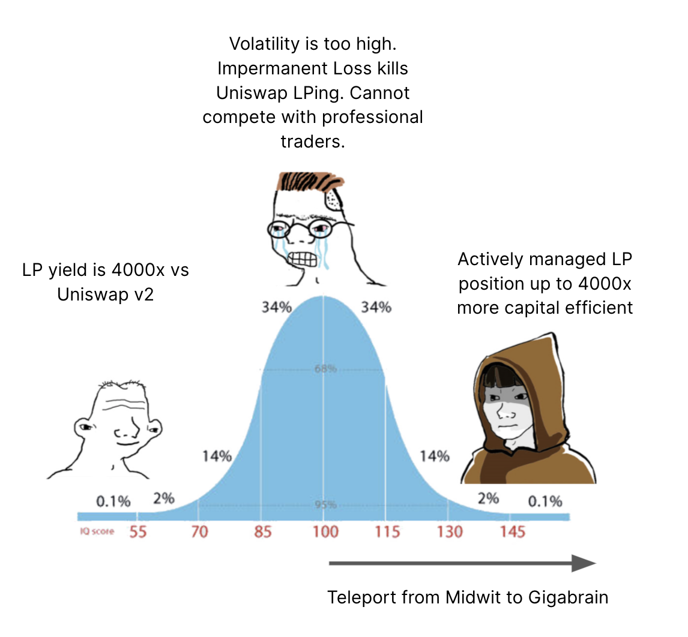

# UniCast

The UniCast project demonstrates and shares machine learning (ML) forecasting and models to Uniswap v3 and the larger Defi and web3 ecosystem.

UniCast provides the tools, building blocks and examples to build, train and serve machine learning predictions for off-chain or on-chain use using Python and open source tools.

The goal of the project is to provide these as free to use and open source examples that can be copied, improved and used as starting points for any number of other machine learning projects in web3. However, we do think that Uniswap v3 is a perfect place to start.

The initial model predicts volatility in Uniswap v3 trading pairs. One way to use these predictions is to find the Uniswap v3 LP range that maximises fees. The model will be deployed with an API that given a probability number and time period suggest a range for LP range.

For example, a user might set a target time frame of 30 days and a probability range of 90%. This means that it will give a prediction for a LP range where the price will stay within the LP range 90% of the time over the coming 30 days. This will be a much wider range than for example 7 days with a 80% probability range.

In closing, the main point of UniCast is not to provide a great model (even if we think it will be useful), but to provide tools for the community to build any number of better or worse, private or public machine learning models for use in web3.

### About Scaleout Labs and more info
Scaleout Labs is building decentralised machine learning solutions, with a focus on web3. The Scaleout Labs team is also a main contributor to the open source federated learning framework FEDn, and the resource manager STACKn.

For project updates:  
Twitter (https://github.com/scaleoutlabs)  
Discord (https://discord.gg/CCRgjpMsVA)  
GitHub (https://github.com/scaleoutlabs)  
Website (https://www.scaleoutsystems.com/scaleoutlabs)  
